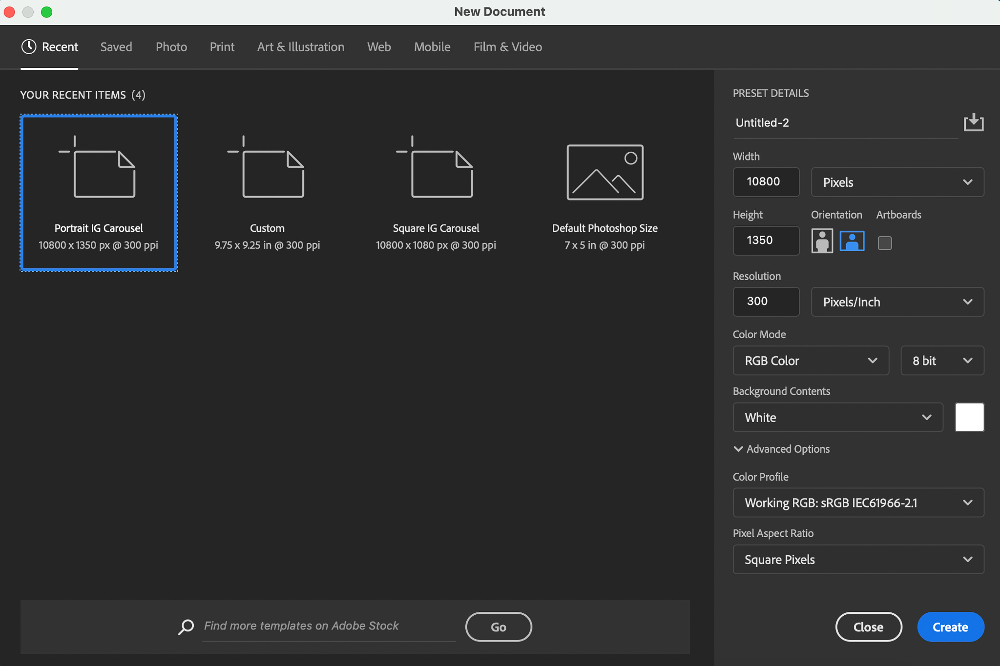
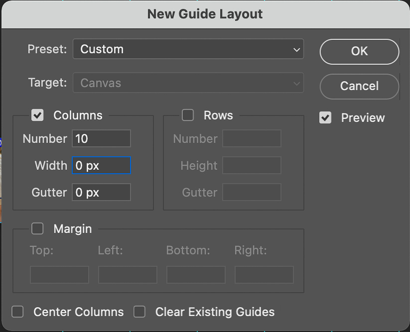
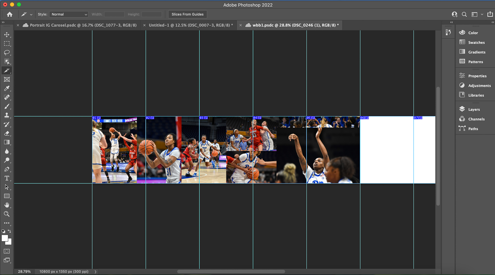

# Photoshop-tutorial# How to create a carousel post for Instagram in Photoshop

A carousel post on Instagram is a post with multiple slides. You can make these slides continuous in Photoshop. Posters create these posts because they make the viewer interact with the post for longer, which increases post engagement on Instagram.

## Materials

- Photoshop
- Instagram account
- Photos
   > - Photos should be in a .jpg format.

## Steps
- Open Photoshop
 - Press 'New File'
   > - Locate the file dimensions on the right of the screen. 
   > - 
   > - Change "Inches" to "Pixels." 
   > - Set width to 10800 and height to 1350.
   > (image
- Press 'Create'
- Create 10 'guides' on the file
  > - Click 'View'
  > - Select 'New Guide Layout'
  > - Change 'Number' to 10. 
  > - Change 'Width' and 'Gutter' to 0.
  > - 
  > - Click 'OK'
- Drag and drop your pictures into Photoshop, one at a time. Each time you add a photo, you must hit the "Enter" key.
- Arrange pictures any way you want.
  > - Each blank space between the guide lines is equal to one Instagram slide. Pictures that spill over the guide lines will spill over slides on Instagram. This creates the "continuous" look.
- Slice the file.
  > - Select the "Slice" tool from the toolbar on the left.
  > - Click "Slide from Guides" on the top bar.
  > - 
- Export the file.
  > - Click "File"
  > - Select "Export"
  > - Select "Save for Web (Legacy)"
  > - Select the "Original" tab
  > - Select file type as "JPEG"
  > - Click "Save"
  

[//]: # (These are reference links used in the body of this note and get stripped out when the markdown processor does its job. There is no need to format nicely because it shouldn't be seen. Thanks SO - http://stackoverflow.com/questions/4823468/store-comments-in-markdown-syntax)

   [dill]: <https://github.com/joemccann/dillinger>
   [git-repo-url]: <https://github.com/joemccann/dillinger.git>
   [john gruber]: <http://daringfireball.net>
   [df1]: <http://daringfireball.net/projects/markdown/>
   [markdown-it]: <https://github.com/markdown-it/markdown-it>
   [Ace Editor]: <http://ace.ajax.org>
   [node.js]: <http://nodejs.org>
   [Twitter Bootstrap]: <http://twitter.github.com/bootstrap/>
   [jQuery]: <http://jquery.com>
   [@tjholowaychuk]: <http://twitter.com/tjholowaychuk>
   [express]: <http://expressjs.com>
   [AngularJS]: <http://angularjs.org>
   [Gulp]: <http://gulpjs.com>

   [PlDb]: <https://github.com/joemccann/dillinger/tree/master/plugins/dropbox/README.md>
   [PlGh]: <https://github.com/joemccann/dillinger/tree/master/plugins/github/README.md>
   [PlGd]: <https://github.com/joemccann/dillinger/tree/master/plugins/googledrive/README.md>
   [PlOd]: <https://github.com/joemccann/dillinger/tree/master/plugins/onedrive/README.md>
   [PlMe]: <https://github.com/joemccann/dillinger/tree/master/plugins/medium/README.md>
   [PlGa]: <https://github.com/RahulHP/dillinger/blob/master/plugins/googleanalytics/README.md>
